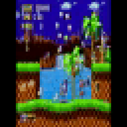
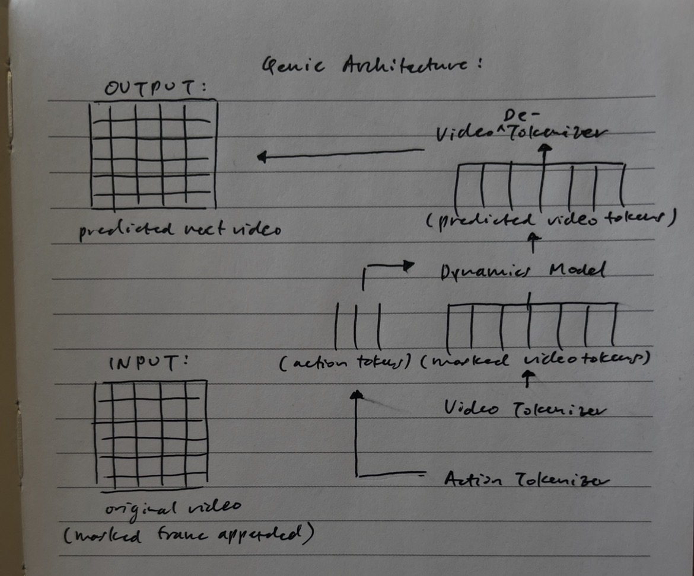
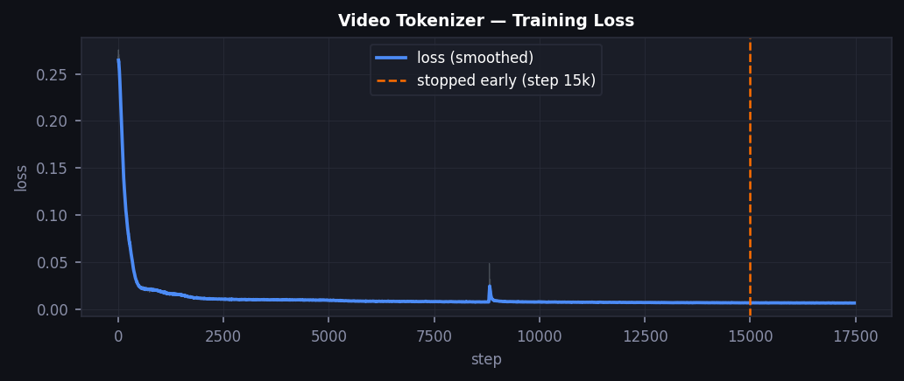
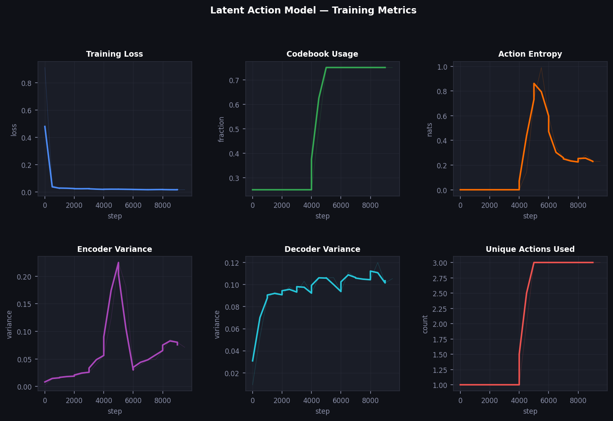
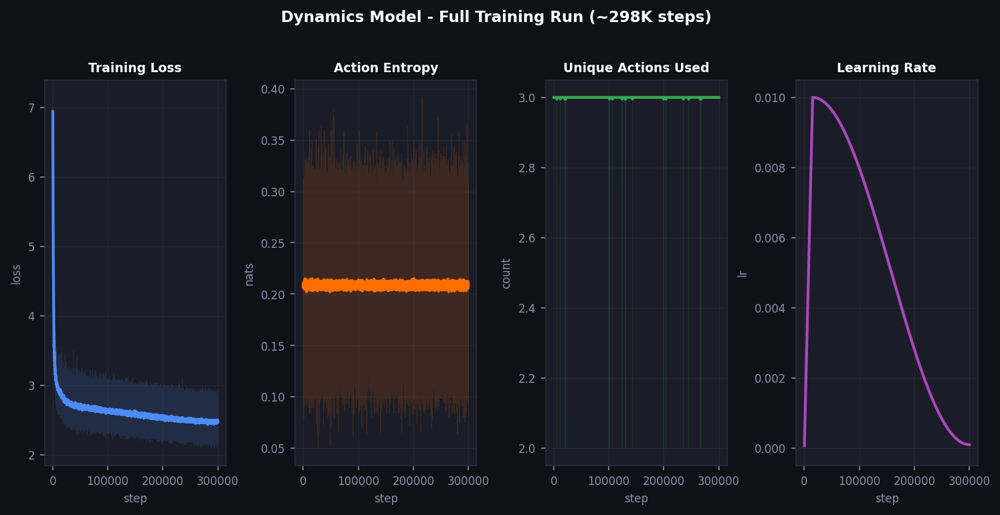

# Genie 3 Reconstruction

A three-stage video world model: **VideoTokenizer** -> **LatentActionModel** -> **DynamicsModel**.

Trained on Sonic the Hedgehog gameplay. The model learns to predict future game frames given a context window of past frames, with optional action conditioning via unsupervised latent action discovery.

## Inference


*Ground truth frames (top row) vs. model-predicted frames (bottom row). Generated autoregressively with no action conditioning.*



## Architecture



Three independently trained stages:

1. **VideoTokenizer** - VQ-VAE that compresses frames into discrete patch tokens via a space-only transformer encoder/decoder with FSQ bottleneck
2. **LatentActionModel** - encodes consecutive frame pairs into discrete action tokens without any action labels (unsupervised); decoder reconstructs next frame from current + action
3. **DynamicsModel** - MaskGIT-style masked transformer that predicts next-frame token distributions, conditioned on context window of past token sequences and optional action tokens

## Training/Inference Acceleration

TinyWorlds supports the following torch features to accelerate training and/or inference:

- **Torch compile** - allows the use of faster CUDA kernels for certain pre-optimized operations like attention and matmuls
- **Distributed data parallel (DDP)** - enables training across multiple GPUs by running the same model on different data per GPU
- **Automatic mixed precision (AMP)** - scales certain ops from FP32 to BF16 based on the current node's floating point range
- **TF32 training** - uses NVIDIA TensorFloat32 for tensor-core-optimized matmuls and convolutions

## Shape Annotation Key

All tensors are shape-annotated and use einops tensor manipulation operations with the following abbreviations:

| Symbol | Meaning |
|--------|---------|
| `B` | batch size |
| `T` | time/sequence dimension (number of frames) |
| `P` | number of patch tokens per frame |
| `E` | embedding dim (d_model) |
| `L` | Video Tokenizer latent dim |
| `A` | Action Tokenizer latent dim (action dim) |
| `D` | number of bins for each video tokenizer dim |
| `L^D` | size of the video tokenizer vocabulary |
| `C` | image channels |
| `H` | pixel-grid height |
| `W` | pixel-grid width |
| `Hp` | patch-grid height |
| `Wp` | patch-grid width |
| `S` | patch size |

## Novel Things Tried

- **AdaLN-Zero conditioning** - replaced FiLM-style feature modulation with AdaLN-Zero: LayerNorm with no learned affine params, followed by a zero-initialized linear that predicts per-token `(scale, shift, gate)` triples from the conditioning signal. The zero init means residual paths start as identity at the beginning of training, which stabilises early optimisation. Included in all three model stages.

- **Rotary Position Embeddings (RoPE)** - replaced additive sinusoidal positional encodings with RoPE: 1D rotary embeddings on the temporal attention axis and 2D rotary embeddings (factored over height and width) on the spatial axis. RoPE is applied directly to Q and K before the attention dot-product rather than added to the token values, so position information decays naturally with distance and the model generalises better to sequence lengths not seen during training.

- **Halton and cosine MaskGIT unmasking schedules** - the original MaskGIT used an exponential confidence schedule to decide how many tokens to unmask each iteration. Added a cosine schedule (unmasks more tokens in later iterations, smoother curve) and a Halton low-discrepancy sequence schedule (quasi-random ordering that avoids the clumping of pure random sampling). Switchable via `maskgit_schedule: "exp" | "cosine" | "halton"` in the inference config.

- **Windowed action attention** - the latent action encoder originally mean-pooled patch embeddings from two consecutive frames and concatenated them before projecting to the action bottleneck. Replaced this with a short self-attention layer (window size 2) over the concatenated patches, letting the model learn which spatial regions are most informative for inferring the transition rather than treating all patches equally.

- **Pre-tokenized dataset cache** - during dynamics training the video tokenizer forward pass ran on every batch even though its weights were frozen. Added a preprocessing script (`scripts/preprocess_tokens.py`) that runs the tokenizer once over the full dataset and saves integer token indices to an HDF5 file. At training time the dynamics model reads pre-computed tokens directly, cutting per-step wall time roughly in half.

- **New datasets** - added Street Fighter, Terraria, and Space Invaders to the dataset registry alongside the existing Sonic, Pong, and Zelda datasets, enabling cross-game generalisation experiments.

## ZELDA Training Run - Live Notes

Training on [The Legend of Zelda: OoT 2D](https://zelda.fandom.com/) gameplay footage on a single NVIDIA L40S (46GB VRAM).

### Environment Setup

First thing that broke: `ModuleNotFoundError: No module named 'utils'`. The scripts import from the project root but Python doesn't know to look there when you run from inside `scripts/`. Fixed with `PYTHONPATH=/path/to/project`.

Second thing: CUDA driver mismatch. The installed PyTorch was built for CUDA 13.0 but the machine's driver only supports 12.4. Had to reinstall:
```
pip install torch==2.6.0+cu124 torchvision==0.21.0+cu124 --index-url https://download.pytorch.org/whl/cu124
```

### Stage 1 - Video Tokenizer

The tokenizer got to ~16K/40K steps and the loss had clearly flattened. ZELDA's visual style is simple, mostly flat colours, tile-based, low texture variance, so there's not that much to learn compared to something like Sonic. Stopped it early and used the step-15000 checkpoint.



One thing I noticed: training speed on the L40S was basically the same as on my M5 Mac (~2.6 it/s). Turned out the DataLoader defaults were set for CPU training: `num_workers=2`, `pin_memory=False`. On Apple Silicon the CPU and GPU share memory so `pin_memory` doesn't matter, but on a discrete GPU it controls whether batches get staged in pinned host memory before the DMA transfer. Changed to `num_workers=8`, `pin_memory=True`, `prefetch_factor=4` and got a 35% throughput improvement to ~3.5 it/s.

Also hit a subtle GPU memory issue: previous training runs that had crashed weren't releasing VRAM. Two zombie processes were holding 44GB between them. `pkill` wasn't enough, had to kill by explicit PID. After clearing those, the full 46GB was available.

### Stage 2 - Latent Action Model

This is the part I found most interesting to watch on W&B. The LAM has no action labels, it has to infer a discrete action space purely from consecutive frame pairs.



Codebook usage started low and climbed steadily over 10K steps. If it stays low it usually means the encoder has collapsed onto a few dominant codes and the model is ignoring most of its `n_actions` vocabulary, so watching it recover is reassuring.

Action entropy tracks how uniform the action distribution is across the dataset. Started low (the model defaulting to a small cluster of codes), then spread out as the codebook filled in. High entropy is what you want, it means the latent actions are doing real work rather than acting as a bypass.

Encoder and decoder variance are worth watching together. Early in training encoder variance was high, the encoder wasn't committing to any region of the codebook space, then settled as codebook usage stabilised. If encoder variance collapses while decoder variance stays high, the quantiser is working but the decoder isn't using the signal. Here both settled at roughly the same time, which looked healthy.

Reconstruction variance was stable throughout, which makes sense: ZELDA frames don't have much dynamic range and the decoder converges fast once the tokenizer is frozen.

The LAM finished 10K steps in ~48 minutes. Loss looked converged well before that, but 10K is short enough that early stopping didn't seem worth it.

### Stage 3 - Dynamics Model

Training complete. 298K steps, ~36 hours total on a single L40S.



Loss came down from 7.13 to a minimum of 2.09, finishing at 2.42. The learning rate followed a warmup-then-cosine-decay schedule, ending near zero, so the model saw a clean full training run.

The action story is the most interesting part. Entropy didn't just stay flat - it actually decreased over the course of training, from 0.20 nats at the start down to 0.17 at the end, with a minimum of 0.05. The model became more concentrated on fewer action codes over time, not more diverse. Only 3 of the 4 codes (`n_actions: 4`) were ever used across the entire run. This suggests the dynamics model learned that one or two latent actions explain most of the transitions in the ZELDA dataset, which is plausible given how repetitive the gameplay is, but it also raises the question of whether the action conditioning is doing useful work or whether the model is mostly ignoring it and relying on the visual context alone. The clearest way to test this is to run inference with and without action tokens and see whether predictions actually differ.
