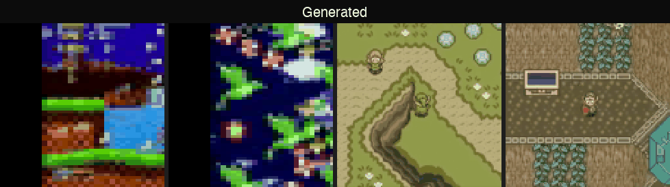
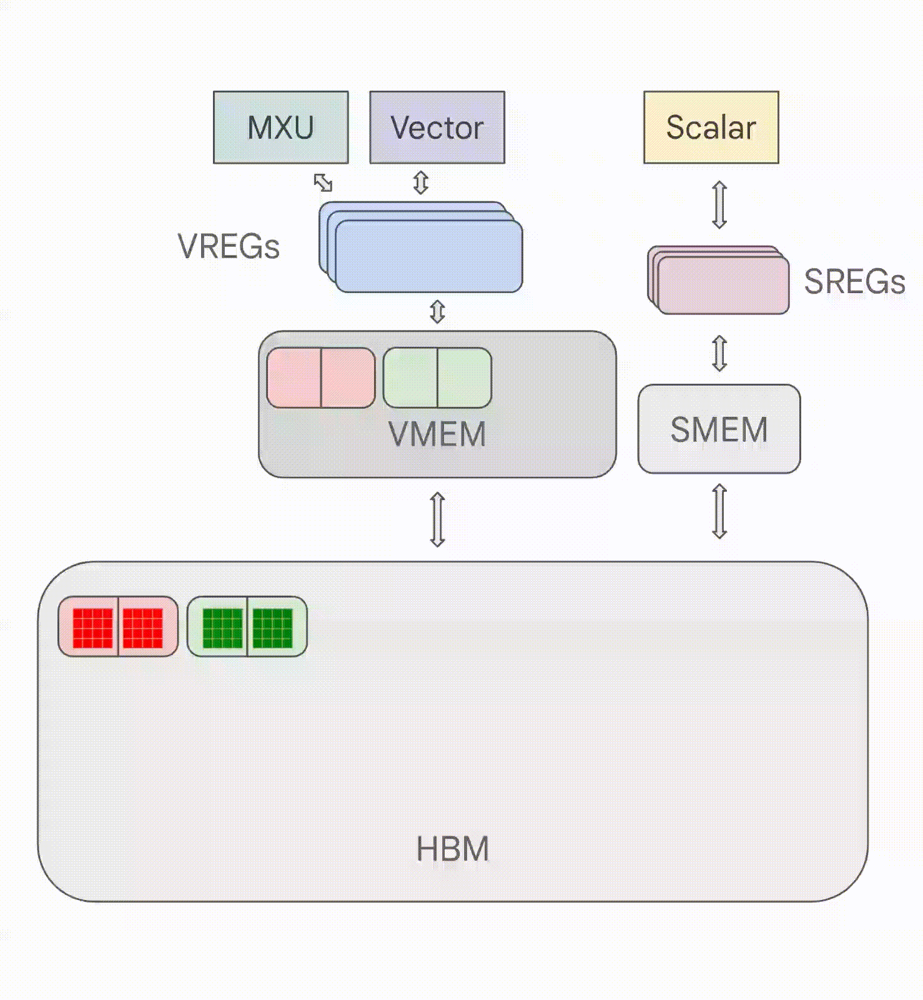

# Genie 3 Reconstruction

A three-stage video world model trained on game footage. The model learns to compress video frames into discrete tokens, infer unsupervised action representations, and predict future frames autoregressively, with no action labels required at any stage.




---

## Architecture

The pipeline has three independently trained stages, each consuming the frozen outputs of the previous one:

```
Raw frames
    │
    ▼
┌─────────────────────┐
│   Video Tokenizer   │  stage 1: VQ-VAE with FSQ bottleneck
│  (encoder + FSQ +   │  frames → discrete patch tokens
│      decoder)       │
└─────────────────────┘
    │  integer indices [B, T, P]
    ▼
┌─────────────────────┐
│  Latent Action      │  stage 2: unsupervised action discovery
│  Model (encoder +   │  consecutive frame pairs → discrete action tokens
│  FSQ + decoder)     │
└─────────────────────┘
    │  action tokens [B, T-1, A]
    ▼
┌─────────────────────┐
│  Dynamics Model     │  stage 3: MaskGIT masked transformer
│  (ST-Transformer)   │  context tokens + actions → next-frame token dist.
└─────────────────────┘
    │
    ▼
Predicted frames (via video tokenizer decoder)
```

---

## Finite Scalar Quantization (FSQ)

Both the video tokenizer and the latent action model use **Finite Scalar Quantization** ([Mentzer et al., 2023](https://arxiv.org/abs/2309.15505)) rather than the standard VQ-VAE codebook.

### The problem FSQ solves

Classic VQ-VAE maintains an explicit codebook of learned embedding vectors. The encoder maps input `z` to the nearest codebook entry. Two failure modes are common:

- **Codebook collapse**: the encoder concentrates on a few entries; most of the vocabulary goes unused.
- **Auxiliary losses**: commitment loss and exponential moving average codebook updates add hyperparameters and can interact badly with the rest of training.

### How FSQ works

Instead of a learned codebook, FSQ quantizes each dimension of the latent independently by bounding it to a small integer grid:

```
z  ──tanh──►  [-1, 1]  ──scale──►  [0, D-1]  ──round──►  integer grid
```

With `latent_dim=5` and `num_bins=4`, the codebook is implicit: every combination of 5 integers each in `{0,1,2,3}` is a valid code, giving `4^5 = 1024` total entries.

**Straight-through gradient**: rounding is not differentiable, so gradients bypass it:

```python
quantized_z = bounded_z + (rounded_z - bounded_z).detach()
```

This passes exact gradients through as if quantization did not exist, while the forward pass uses the rounded values.

**No collapse by construction**: every bin exists by definition; the encoder cannot "ignore" part of the vocabulary the way it can with a learned codebook. No commitment loss, no EMA update, no auxiliary terms.

### Index encoding / decoding

Codes are converted to a single integer index via a mixed-radix representation:

```
index = Σ  digit_i  ×  D^i
         i
```

where `digit_i = round(scale_and_shift(z_i))` and `D^i` is the pre-computed basis. This allows efficient lookup in both directions without storing an explicit embedding table.

---

## Space-Time Transformer (ST-Transformer)

All three model stages use the same `STTransformer` backbone. Rather than flattening space and time into a single sequence, it interleaves dedicated **spatial** and **temporal** attention layers inside each block.

### Block structure

```
Input: x  [B, T, P, E]
           │
           ▼
    SpatialAttention       attends across P patches, independently per timestep
           │               reshapes: [B, T, P, E] → (B×T) batches of P tokens
           ▼
    TemporalAttention      attends across T frames, independently per patch
           │               reshapes: [B, T, P, E] → (B×P) batches of T tokens
           │               causal mask applied so frame t cannot attend to t+k
           ▼
    SwiGLU FFN             position-wise feed-forward with gated linear unit
           │
           ▼
Output: x  [B, T, P, E]
```

Factoring attention this way keeps the dominant cost at `O(T·P²)` for spatial and `O(P·T²)` for temporal, rather than the `O((T·P)²)` of full joint attention. At `T=4`, `P=256` (128×128 frame, patch size 8): spatial cost ∝ 4·256² = 262K vs joint ∝ 1024² = 1M.

### Conditioning

Action tokens `[B, T, A]` are injected via **AdaLN-Zero**: LayerNorm with no learned affine parameters, followed by a zero-initialized linear that produces per-token `(scale, shift, gate)` triples from the conditioning signal. Zero initialization means every residual path starts as an identity at the beginning of training, stabilizing early optimization.

The alternative (`use_adaln_zero=False`) is **FiLM**-style post-norm conditioning, which scales and shifts the normalized representation multiplicatively.

### Positional encodings

**Default (sinusoidal)**: temporal position is encoded as sinusoidal embeddings added to the last `E/3` dimensions; the first `2E/3` carry a 2D spatial sinusoidal encoding (factored over height and width patch indices).

**Optional (RoPE)**: `use_rope=True` replaces additive encodings with Rotary Position Embeddings applied directly to Q and K before the dot-product. 2D RoPE on the spatial axis (factored over `Hp`, `Wp`), 1D RoPE on the temporal axis. Position information decays naturally with distance, giving better generalization to sequence lengths not seen during training.

### SwiGLU feed-forward

```
SwiGLU(x) = W_o( silu(W_v(x))  ×  W_g(x) )
```

`hidden_dim` is internally scaled to `floor(2h/3)` so parameter counts stay comparable to a standard two-layer MLP of the same width.

---

## Video Tokenizer

**Goal**: compress raw pixel frames into a compact sequence of discrete integer tokens, one token per spatial patch.

### Encoder

```
frames [B, T, C, H, W]
    │
PatchEmbedding           unfold into non-overlapping S×S patches, linear project to E
    │  [B, T, P, E]
STTransformer (causal)   contextualize patches across space and time
    │  [B, T, P, E]
Linear head              project to latent_dim L
    │  [B, T, P, L]
FSQ                      per-dimension tanh → round → straight-through
    │  [B, T, P, L]  (each entry in {0, …, D-1})
```

With `patch_size=8`, `frame_size=128`, `latent_dim=5`, `num_bins=4`:
- `P = (128/8)² = 256` patches per frame
- codebook size `= 4^5 = 1024`
- each frame becomes `256` integer tokens, each in `[0, 1023]`

### Decoder

```
quantized latents [B, T, P, L]
    │
Linear (L → E)           embed back to transformer dim
    │  [B, T, P, E]
    + spatial PE          2D sinusoidal over patch grid
    │
STTransformer (causal)
    │  [B, T, P, E]
PixelShuffleFrameHead    Conv2D then pixel-shuffle to reconstruct full resolution
    │  [B, T, C, H, W]
```

The `PixelShuffleFrameHead` avoids transposed convolutions: it predicts `C × S² = 3 × 64` channels at patch resolution via a 1×1 conv, then rearranges them into a full `H×W` image with einops.

### Training objective

Smooth L1 loss between reconstructed and original frames. No perceptual or adversarial losses in the current implementation.

---

## Action Tokenizer (Latent Action Model)

**Goal**: infer a compact discrete action representation from consecutive frame pairs, without any action labels.

### Encoder

```
frames [B, T, C, H, W]
    │
PatchEmbedding + STTransformer
    │  [B, T, P, E]
    │
for each consecutive pair (t, t+1):
    ├─ default: mean-pool patches → concat [E, E] → MLP → [A]
    └─ windowed: self-attention over 2P concat patches → mean-pool → MLP → [A]
    
action_latents [B, T-1, A]
    │
FSQ (num_bins=2, so {-1, +1} per dim)
    │  [B, T-1, A]   (n_actions = 2^A discrete codes)
```

With `n_actions=4`, `A=2`: four possible discrete actions encoded as 2-bit binary vectors.

**Windowed attention** (`use_windowed_attention=True`): concatenates all `P` patches from both frames into a `2P`-length sequence and runs a single self-attention layer before mean-pooling. This lets the encoder learn *which spatial regions* are informative for inferring the transition, rather than treating all patches equally.

### Decoder

The decoder reconstructs the next frame conditioned on the current frame and the inferred action token. It uses the same ST-Transformer with action latents as AdaLN-Zero conditioning.

During training, all patch tokens except those from the first frame are replaced with a learned `mask_token` at `keep_rate=0.0`. This forces all transition information to flow through the action bottleneck; the decoder cannot "cheat" by reading the next frame's patches directly.

### Training objective

Reconstruction loss (smooth L1) on predicted vs. actual next frames, plus a **variance penalty**:

```
total_loss = recon_loss + λ · relu(var_target - var(z))
```

The variance term pushes encoder outputs to spread across the codebook rather than collapsing onto a few codes. The current model uses `λ=100`, `var_target=0.01`.

---

## Dynamics Model

**Goal**: given a context window of past discrete frame tokens and optional action tokens, predict the token distribution for the next frame(s).

### Architecture

The dynamics model is a masked transformer (MaskGIT-style) operating on the integer token sequences produced by the frozen video tokenizer.

```
context tokens [B, T, P]  +  action tokens [B, T, A]
    │
index → latent (FSQ basis)     convert indices back to float latents
    │  [B, T, P, L]
Linear (L → E)
    │  [B, T, P, E]
    + spatial PE
    │
STTransformer (causal, action-conditioned)
    │  [B, T, P, E]
Linear (E → codebook_size)     logit over all 1024 token types per patch
    │  [B, T, P, 1024]
```

### Training: random masking

At each training step a random mask ratio in `[0.5, 1.0)` is sampled. Masked positions are replaced with a learned `mask_token`. The loss is cross-entropy over masked positions only, forcing the model to reconstruct tokens it cannot see from context it can.

One temporal anchor is always kept unmasked per `(B, P)` so the model always has at least one reference frame to attend to.

### Inference: iterative unmasking (MaskGIT)

Generation proceeds by repeatedly unmasking the most confident tokens:

```
for m in range(num_steps):
    logits = transformer(input_with_masks)
    confidence = max softmax prob per masked token
    unmask top-k most confident tokens this step
    k grows according to schedule until all tokens are revealed
```

Three unmasking schedules are supported via `maskgit_schedule`:
- `"exp"`: exponential: slow start, fast finish
- `"cosine"`: cosine ramp: smooth, more tokens revealed in later steps
- `"halton"`: Halton low-discrepancy sequence: quasi-random ordering that avoids clumping; distributes unmasking steps more uniformly across the confidence range

---

## Shape Annotation Key

All tensors are shape-annotated using einops operations with the following symbols:

| Symbol | Meaning |
|--------|---------|
| `B` | batch size |
| `T` | time / sequence dimension (number of frames) |
| `P` | number of patch tokens per frame |
| `E` | embedding dim (`d_model`) |
| `L` | video tokenizer latent dim |
| `A` | action tokenizer latent dim |
| `D` | number of bins per FSQ dimension |
| `L^D` | codebook size (total discrete codes) |
| `C` | image channels |
| `H` | pixel-grid height |
| `W` | pixel-grid width |
| `Hp` | patch-grid height (`H / S`) |
| `Wp` | patch-grid width (`W / S`) |
| `S` | patch size |

---

## Scaling the Model: Roofline Analysis

The [DeepMind Scaling Book](https://jax-ml.github.io/scaling-book/roofline/) frames GPU utilization around a single quantity: **arithmetic intensity**, the ratio of FLOPs performed to bytes transferred from HBM.

```
Intensity  =  FLOPs / Bytes
```

The animation below shows a TPU performing an elementwise product. Each output value requires loading two input values from memory, computing one multiply, then writing the result back. Depending on the size of the arrays and the bandwidth of the memory links involved, the operation ends up either compute-bound (the hardware's multiply units are fully saturated and memory can keep up) or memory-bound (the multiply units sit idle, waiting for the next values to arrive from HBM). Almost every operation in a transformer falls into one of these two regimes, and which one determines whether adding more FLOPs or more bandwidth actually speeds things up.



When intensity exceeds the hardware's peak ratio (FLOPs/s divided by bandwidth), the kernel is **compute-bound**; below it, it is **bandwidth-bound** and the accelerator is idle waiting for memory.

| Hardware | Peak bfloat16 FLOPs/s | HBM bandwidth | Critical intensity |
|----------|----------------------|---------------|-------------------|
| H100 | 989 TF/s | 3.35 TB/s | ~295 FLOPs/byte |
| TPU v5e | 197 TF/s | 0.82 TB/s | ~240 FLOPs/byte |

For a standard matmul `[B, D] · [D, F]`, intensity ≈ `B` tokens when `B ≪ D, F`. The model is compute-bound only when `B > 295` on H100. **B here is tokens per replica, not sequences.**

### Current model: where we stand

The current configuration is tiny: `E=32`, `hidden_dim=128`, 8 dynamics blocks. Parameter count ≈ 170K. At training batch size 500, with `T=4` frames and `P=256` patches:

```
tokens per step  =  500 × 4 × 256  =  512K
```

Training is comfortably compute-bound. The bottleneck is that the model is so small that individual matmuls (`[512K, 32] · [32, 128]`) have low intensity; `B=512K` tokens but `D=32` is tiny, so the weight matrix fits in L2 cache and memory bandwidth is not the limiter. The real problem is low arithmetic throughput: `32×32` matmuls are far below the GPU's tensor core granularity (typically 16×16 or 32×32 tiles), leaving most tensor cores idle.

**During MaskGIT inference**, batch size collapses to 1: `B=1 × T=5 × P=256 = 1280 tokens`. With `E=32`, intensity ≈ 1280 >> 295, so matmuls are still compute-bound, but the model is so small that raw throughput is dominated by kernel launch overhead and autoregressive iteration count, not FLOP rate.

### Scaling recommendations

#### 1. Increase embedding dimension (highest leverage)

The single most impactful change is growing `E`. Attention and FFN FLOPs scale as `O(E²)`, so doubling `E` quadruples FLOPs while only doubling parameter count:

| Config | E | Blocks | ~Params | Matmul dims | Notes |
|--------|---|--------|---------|-------------|-------|
| Current | 32 | 8 | 170K | [B·T·P, 32]·[32,128] | Below tensor core efficiency |
| Small | 128 | 8 | 2.5M | [B·T·P, 128]·[128,512] | Efficient on H100 |
| Medium | 256 | 12 | 18M | [B·T·P, 256]·[256,1024] | Genie-comparable |
| Large | 512 | 16 | 110M | [B·T·P, 512]·[512,2048] | Near Genie-1B range |

At `E=256` the weight matrices are large enough that matmuls become the true FLOP bottleneck rather than memory or kernel overhead. This is where scaling laws begin to apply reliably.

#### 2. Increase patch token count via smaller patches

Reducing `patch_size` from 8 to 4 quadruples `P` from 256 to 1024. Spatial attention cost scales `O(P²)`, going from 256² = 65K to 1024² = 1M per frame per batch element. The upside: the tokenizer captures finer-grained detail (4×4 patches vs 8×8), which directly improves reconstruction fidelity before the dynamics model ever runs. The roofline implication: more tokens means higher effective batch size per sequence, pushing inference further into the compute-bound regime. Implement this with Flash Attention (chunked attention that never materializes the full `P×P` matrix) to keep memory linear in `P`.

#### 3. Extend context window T

Temporal attention cost scales `O(T²)`. At `T=4` the temporal attention matrix is 4×4 = 16 elements per patch, negligible. Scaling to `T=16` gives 256 elements; `T=64` gives 4K. The model can attend over much longer histories with no architectural change, just a larger context buffer. The roofline benefit: longer sequences mean more tokens per forward pass, which increases arithmetic intensity during inference (where the usual bottleneck is small batch size). Each forward pass becomes more work per weight load.

#### 4. Mixed-precision quantization for inference

At inference time (batch size 1), matmuls are bandwidth-bound despite large `T·P`. Int8 weight quantization halves the bytes loaded per weight matrix, cutting the bandwidth bottleneck threshold from 295 to ~120 tokens on H100. The dynamics model's output head `[E, 1024]` alone has 32K parameters; at fp32 that's 128KB of weight loads per forward pass. At int8: 32KB. Apply `torch.int8` quantization to all `nn.Linear` layers in the dynamics transformer (Q, K, V, O projections and FFN) while keeping activations in bfloat16.

#### 5. Mixture of Experts (MoE) for cheap parameter scaling

The codebase already includes `MoeSwiGLUFFN`. With 8 experts and top-2 routing, the model has 8× the FFN parameters but only 2× the FLOPs per token. This is the most FLOP-efficient way to scale capacity. The roofline constraint flips: the MoE batch-size threshold becomes `B > 120·E/k` (from the scaling book), where `E=num_experts` and `k=top_k`. At 8 experts, 2 active: threshold = `120 × 8 / 2 = 480 tokens`, still easily met during training. Each expert's FFN is smaller, so expert matrices must be sized large enough to maintain per-expert arithmetic intensity above 120 tokens.

#### 6. Gradient checkpointing for depth scaling

Deeper models (more blocks) scale parameter counts roughly linearly while increasing representational depth. Activation memory scales linearly with depth; gradient checkpointing re-computes activations during the backward pass instead of storing them, trading ~33% more FLOPs for a constant memory footprint regardless of depth. This removes the memory ceiling on depth, allowing 32–64 block models to train within a fixed VRAM budget.

#### 7. Tensor parallelism for large E

At `E=512+`, the Q, K, V, O projection matrices are large enough to warrant tensor parallelism: split the head dimension across GPUs, communicate via all-reduce after the output projection. For spatial attention over `P=1024` patches with `E=512`, each attention head matrix is `[P, D] = [1024, 64]`, and 8 heads occupy `8 × 1024 × 64 × 2 bytes = 1MB` of HBM per batch element, still tractable on a single GPU, but tensor parallelism removes the activation bottleneck when `B × T × P` is large.

---

## Extending Visual Memory Beyond 1 Minute

The current model uses a context window of `T=4` frames at 2 fps, about 2 seconds of visual history. A 1-minute horizon at 2 fps requires `T=120` frames; at 10 fps it requires `T=600`. Several concrete extensions enable this within the current architecture.

### The core constraint

Temporal attention is `O(T²)` in FLOPs and `O(T²)` in activation memory (the attention matrix `[(B×P), H, T, T]`). At `T=120`, `P=256`, `B=1`: the temporal attention matrix across 8 heads is `1 × 256 × 8 × 120 × 120 × 2 bytes = 59MB`. Manageable, but grows quadratically. At `T=600` it becomes 1.5GB per layer.

### Option 1: Sliding window with compressed memory tokens

Retain a fixed-size sliding window of recent frames (e.g. `T_local=16`) for high-resolution temporal attention. Periodically compress older frames into a small set of **memory tokens** via a learned pooling operation and append them to the front of the context:

```
[mem_1, mem_2, ..., mem_K,  frame_{t-15}, ..., frame_t]
    ↑                           ↑
  K=8 compressed memory      T_local=16 recent frames
  tokens (each = weighted     at full resolution
  sum of 8 past frames)
```

In code, add a `MemoryCompressor` module after each group of `T_compress` frames:

```python
class MemoryCompressor(nn.Module):
    def __init__(self, embed_dim, n_memory_tokens):
        super().__init__()
        self.query = nn.Parameter(torch.randn(n_memory_tokens, embed_dim))
        self.cross_attn = nn.MultiheadAttention(embed_dim, num_heads=8)
    
    def forward(self, past_frame_tokens):  # [T_old, P, E]
        flat = past_frame_tokens.reshape(1, -1, E)  # [1, T_old*P, E]
        q = self.query.unsqueeze(0)                 # [1, K, E]
        mem, _ = self.cross_attn(q, flat, flat)     # [1, K, E]
        return mem                                  # [1, K, E]
```

Memory tokens attend alongside regular frame tokens in temporal attention. The temporal attention window is bounded at `T_local + K` regardless of total episode length. This is exactly how Perceiver AR and Compressive Transformer extend context; the current ST-Transformer's temporal attention accepts any sequence of tokens, so memory tokens slot in without architectural changes.

### Option 2: Flash Attention with KV-cache eviction

Replace the current explicit `torch.matmul` attention in `TemporalAttention` with Flash Attention 2 (available via `torch.nn.functional.scaled_dot_product_attention`). Flash Attention computes attention in tiles without materializing the full `T×T` matrix, so memory becomes `O(T)` rather than `O(T²)`.

For inference with a growing KV cache, implement **recency-weighted eviction**: when the KV cache exceeds a budget of `T_max` frames, evict the oldest frame with probability proportional to how dissimilar it is from the current frame (measured by cosine distance between mean patch embeddings). This biases the cache toward retaining frames that were visually distinct, preserving more diverse long-range context than naive sliding window.

```python
def evict_kv_cache(keys, values, current_frame_key, budget):
    # keys: [T, P, E]
    frame_keys = keys.mean(dim=1)           # [T, E] -- mean over patches
    curr = current_frame_key.mean(dim=0)    # [E]
    sim = F.cosine_similarity(frame_keys, curr.unsqueeze(0))  # [T]
    # keep the budget-1 most dissimilar frames + the most recent
    _, keep_idx = torch.topk(-sim[:-1], budget - 1)  # keep dissimilar old frames
    keep_idx = torch.cat([keep_idx, torch.tensor([len(sim)-1])])  # always keep latest
    return keys[keep_idx], values[keep_idx]
```

### Option 3: Hierarchical temporal tokenization

Instead of treating all `T` frames equally, build a two-level temporal hierarchy:

- **Fine level**: the last `T_local=8` frames at full patch resolution `P=256`
- **Coarse level**: every 8th frame for the preceding `T_coarse=16` frames, with patches spatially pooled to `P_coarse=64`

The STTransformer already handles variable `T`; adding a learned `level_embedding` (similar to token type embeddings in BERT) distinguishes coarse from fine tokens. Fine tokens attend to all tokens; coarse tokens attend only to other coarse tokens in spatial attention to reduce cost.

This gives an effective receptive field of `8 + 16×8 = 136 frames` (1 min at 2 fps) with `8×256 + 16×64 = 3072` total tokens, only 12× the current context size.

### Option 4: Learned temporal downsampling via the action tokenizer

The latent action model already encodes each frame transition into a compact 2-bit vector. For long-horizon memory, store the full action sequence `[T_long, A]` (which at `A=2` is just `T_long` bits) and use it to re-synthesize approximate frame tokens on demand. The dynamics model can condition on reconstructed-from-actions tokens for distant frames and on exact observed tokens for recent frames. This is lossless for the action channel and gracefully lossy for the visual channel over long time horizons.

---

## Multi-Agent Interactions

The current model simulates a single agent in a single-player environment. Extending to multi-agent settings where multiple entities have independent dynamics and interact, requires the world model to maintain separate belief states for each agent and model their cross-agent effects.

### The current representation gap

All `P=256` patch tokens represent the global scene. There is no mechanism to:
- distinguish which pixels belong to which agent
- condition different agents' predictions on different action sequences
- model the effect of one agent's action on another agent's state

### Extension 1: Per-agent action conditioning

The simplest extension adds an **agent ID embedding** to action tokens and conditions temporal attention separately per agent. Each agent `i` produces an action vector `a_i ∈ [B, T, A]`; these are concatenated along a new agent dimension and embedded:

```python
# Before: conditioning [B, T, A]
# After:  conditioning [B, T, N_agents, A]

agent_embeds = action_embed(actions)          # [B, T, N, E_a]
agent_id_emb = agent_id_table(agent_ids)      # [B, T, N, E_a]
conditioning  = agent_embeds + agent_id_emb   # [B, T, N, E_a]
```

The STTransformer's AdaLN-Zero conditioning currently expects `[B, T, A]`. Change `conditioning_dim` to `N × A` and reshape. Each agent's action token modulates the scene tokens independently, allowing the dynamics model to attribute scene changes to specific agents.

### Extension 2: Agent-centric spatial tokens

Instead of one flat grid of `P` scene tokens, partition patches into **agent-local** and **background** tokens:

1. At each timestep, detect bounding boxes for `N` agents (via a small learned detector or a simple heuristic segmenter operating on the discrete token indices).
2. Label each patch as `background`, `agent_0`, ..., `agent_{N-1}` and add a learned `entity_type` embedding to each patch token.
3. Spatial attention is **factored**: background patches attend to all patches; agent patches attend to background patches plus patches of the same agent. Cross-agent attention is gated by a learned interaction matrix.

```python
class FactoredSpatialAttention(nn.Module):
    def forward(self, x, entity_labels):
        # x: [B, T, P, E]
        # entity_labels: [B, T, P] integers in {background, agent_0, ...}
        
        # background self-attention (full P×P)
        bg_mask = (entity_labels == 0)  # [B, T, P]
        x_bg = self_attn_masked(x, bg_mask)
        
        # per-agent self-attention + cross-attention to background
        for i in range(N_agents):
            ag_mask = (entity_labels == i+1)
            x_agent_i = cross_attn(x[ag_mask], x_bg)  # agent attends to background
            # inter-agent attention gated by interaction weight w_ij
            for j in range(N_agents):
                if i != j:
                    x_agent_i += w[i,j] * cross_attn(x[ag_mask], x[entity_labels==j+1])
        
        return x_updated
```

This scales as `O(P_bg² + N × P_agent²)` rather than `O(P²)` and makes the interaction graph explicit and inspectable.

### Extension 3: Separate dynamics heads per agent

Once agent tokens are factored, train separate output heads, one per agent type, that predict tokens only for that agent's patches. This allows each agent type (player, enemy, NPC) to have a specialized prediction module while sharing the ST-Transformer backbone for scene understanding.

```python
class MultiAgentDynamicsHead(nn.Module):
    def __init__(self, embed_dim, codebook_size, n_agent_types):
        super().__init__()
        self.background_head = nn.Linear(embed_dim, codebook_size)
        self.agent_heads = nn.ModuleList([
            nn.Linear(embed_dim, codebook_size) for _ in range(n_agent_types)
        ])
    
    def forward(self, transformed, entity_labels):
        logits = torch.zeros(*transformed.shape[:-1], self.codebook_size)
        logits[entity_labels == 0] = self.background_head(transformed[entity_labels == 0])
        for i, head in enumerate(self.agent_heads):
            mask = (entity_labels == i + 1)
            logits[mask] = head(transformed[mask])
        return logits
```

The unsupervised latent action model can be extended to encode per-agent actions by running the encoder independently on each agent's patch crop at timestep `t` and `t+1`, then quantizing N separate action vectors.

### Extension 4: Joint action inference for interaction modeling

For modeling interactions (e.g. player attacks enemy), the latent action model needs to infer not just "what did agent A do" but "what effect did agent A's action have on agent B". This is done by conditioning the action encoder on the identity of both agents:

```
frame_t patches of agent A + frame_{t+1} patches of agent B
    → joint action encoder
    → interaction token z_AB  ∈  {0,1}^A
```

The interaction token `z_AB` captures "the transition of B given A's action", effectively a relational action. The dynamics model then conditions on both self-action tokens `z_A` and interaction tokens `z_AB` when predicting agent B's next state. This requires no external labels: the model discovers which agent-pair interactions are informative purely from visual co-occurrence patterns in the training data.

---

## Training / Inference Acceleration

- **Torch compile**: `torch.compile` traces the model into optimized CUDA kernels for attention and matmuls
- **Distributed data parallel (DDP)**: same model on different data per GPU; gradient all-reduce after each backward
- **Automatic mixed precision (AMP)**: scales ops from FP32 to BF16 based on dynamic range
- **TF32**: NVIDIA TensorFloat32 for tensor-core-optimized matmuls and convolutions on Ampere+
- **Pre-tokenized cache**: `scripts/preprocess_tokens.py` runs the frozen video tokenizer once and saves indices to HDF5; dynamics training reads pre-computed tokens directly, halving per-step wall time

---

## Novel Things Tried

- **AdaLN-Zero conditioning**: zero-initialized linear predicting `(scale, shift, gate)` per token from conditioning signal; residual paths start as identity at init, stabilising early training. Included in all three stages.

- **Rotary Position Embeddings (RoPE)**: 2D RoPE on spatial axis (factored over Hp, Wp), 1D RoPE on temporal axis. Applied to Q and K before dot-product; position information decays with distance, generalises better to unseen sequence lengths.

- **Halton and cosine MaskGIT unmasking schedules**: cosine schedule unmasks more tokens in later iterations; Halton low-discrepancy sequence avoids clumping of pure random sampling. Switchable via `maskgit_schedule: "exp" | "cosine" | "halton"`.

- **Windowed action attention**: self-attention over the concatenated patches of two consecutive frames before pooling to the action bottleneck, letting the encoder learn which spatial regions are most informative for inferring the transition.

- **Pre-tokenized dataset cache**: runs the video tokenizer once offline, stores integer indices in HDF5. Cuts per-step dynamics training time by ~50%.

- **New datasets**: Street Fighter, Terraria, and Space Invaders added to the dataset registry alongside Sonic, Pong, Zelda, and PicoDoom for cross-game generalisation experiments.
